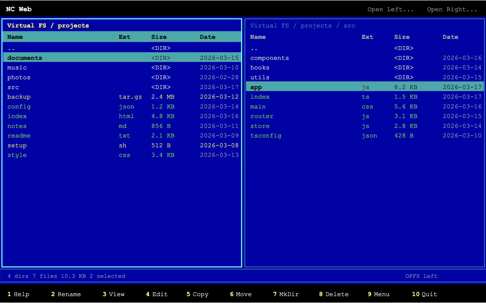

# NC Web

A modern [Norton Commander](https://en.wikipedia.org/wiki/Norton_Commander) dual-pane file manager that runs entirely in the browser.



## Features

- **Dual-pane layout** -- independent left/right panels, each browsing its own directory
- **Two file system backends** -- browser-private storage (OPFS) out of the box, plus optional native filesystem access via the File System Access API
- **Cross-adapter operations** -- copy and move files between OPFS and your local disk seamlessly
- **Built-in text editor** -- view (F3) and edit (F4) text files inline with save support
- **Classic keyboard workflow** -- F-key toolbar, Insert/Space selection, Tab to switch panels, and all the shortcuts you remember
- **Sorting** -- click column headers to sort by name, extension, size, or date
- **Context menu** -- right-click (or long-press on mobile) for quick actions
- **Mobile support** -- swipe between panels, responsive layout, installable PWA
- **Offline-capable** -- service worker caches all assets for full offline use
- **Zero dependencies** -- vanilla JavaScript, no frameworks, no build step

## Quick Start

Serve the directory with any static file server:

```bash
# Python
python3 -m http.server 8000

# Node
npx serve .

# PHP
php -S localhost:8000
```

Then open `http://localhost:8000` in your browser.

## Keyboard Shortcuts

| Key | Action |
|---|---|
| Tab | Switch panels |
| Arrow Up / Down | Move cursor |
| Home / End | Jump to first / last entry |
| Enter | Open directory or file |
| Backspace | Go to parent directory |
| Insert | Toggle selection, move down |
| Space | Toggle selection |
| Ctrl+A | Select all |
| Escape | Deselect all / close dialog |
| Delete | Delete selected |
| F1 | Help |
| F2 | Rename |
| F3 | View file |
| F4 | Edit file |
| F5 | Copy to other panel |
| F6 | Move to other panel |
| F7 | Create directory |
| F8 | Delete |
| F9 | Context menu |
| F10 | Quit |

## Browser Support

Requires a modern browser with ES modules and the Origin Private File System API. Native filesystem access (the "Open Left/Right" buttons) additionally requires the File System Access API (Chromium-based browsers).

## License

[GPL-3.0](LICENSE)
